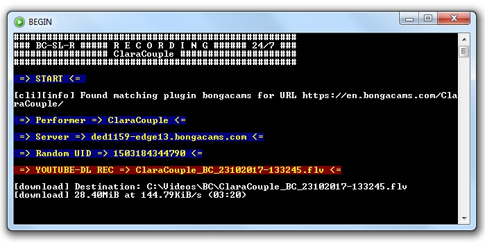
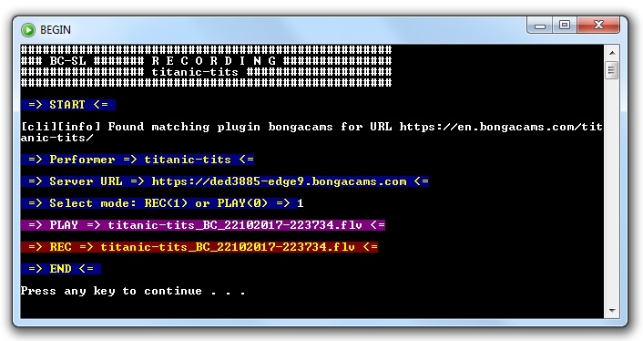

# streamlink-bongacams
streamlink-bongacams lets you follow and archive your selected models shows on www.bongacams.com and Bongacams white labels sites.
BC streamlink-bongacams plugin that you see here use the SM_Model.txt where is a list of your favourites BC models.
You don't need to be registered bongacams user for recording models with this streamlink-bongacams plugin.
For this plugin I used python code from @sdfwv, thank you very much for that. I adapted that plugin for ffmpeg recordng.

Requirements
============
1. Download here [Python 2.7.13](https://www.python.org/ftp/python/2.7.13/python-2.7.13.msi) instalation. Those who need to install python should watch this [video](https://www.youtube.com/watch?v=QYUBz4mrnFU)
2. Last version of [streamlink](https://github.com/streamlink/streamlink).
3. Last version of [ffmpeg and ffplay](https://ffmpeg.zeranoe.com/builds/). Default location is C:/Windows, otherwise `config.cfg` must be edited.

Setup
=====
1. Install requirements `pip install -r Requirements.txt`. Streamlink can be installed as a stand-alone program but my recommendation is to install it as a python module along with other modules.
2. Download and unpack the [code](https://codeload.github.com/horacio9a/streamlink-bongacams/zip/master).
3. BC streamlink-bongacams plugin `bongacams.py` must replace old plugin in `C:/Python27/Lib/site-packages/streamlink/plugins/bongacams.py`
4. Batch script sm.bat can be anywhere (default is `C:/Windows`).
5. BC favourite list `BC_Model.txt` can be anywhere (default is `C:/Windows`).
6. `config.cfg` must be in `C:/Python27/config.cfg`. Edit `config.cfg` to your wish or accept default data. You must enter the correct location on your computer for all the files that are there. In that case, those files do not have to be in the path.

Running & Output
================
It's best to use 'Command Promt' window to install `Requirements.txt`.
For easier use of this plugin it would be good to make a shortcut and put it in the task bar for easier startup. 
However, if you want to record a certain model permanently (24/7), then you need to use `bc.bat`, options number `1` and `0` for online use.
For permanently recording more than one model at the same time you need to start another copy of `bc.bat`. 
Recording is best abort with Ctrl-C or by clicking 'x' at the top right corner of the script window If Ctrl-C does not react.

If you don't want to keep track of a specific model, then you can use `bongacams2.py` which has play option and it is possible to use the same script window to start many models.

